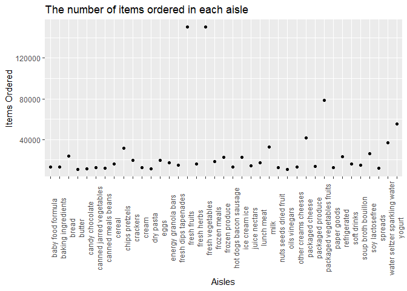

HW3
================

## Problem 1 Solution

#### Importing data

``` r
library(p8105.datasets)
data("instacart")

tail(instacart)
```

    ##         order_id product_id add_to_cart_order reordered user_id eval_set
    ## 1384612  3421063      13565                 2         1  169679    train
    ## 1384613  3421063      14233                 3         1  169679    train
    ## 1384614  3421063      35548                 4         1  169679    train
    ## 1384615  3421070      35951                 1         1  139822    train
    ## 1384616  3421070      16953                 2         1  139822    train
    ## 1384617  3421070       4724                 3         1  139822    train
    ##         order_number order_dow order_hour_of_day days_since_prior_order
    ## 1384612           30         0                10                      4
    ## 1384613           30         0                10                      4
    ## 1384614           30         0                10                      4
    ## 1384615           15         6                10                      8
    ## 1384616           15         6                10                      8
    ## 1384617           15         6                10                      8
    ##                                                             product_name
    ## 1384612 No Salt Added Gluten-Free Blue Chips Made with Organic Blue Corn
    ## 1384613                                           Natural Artesian Water
    ## 1384614                                             Twice Baked Potatoes
    ## 1384615                                  Organic Unsweetened Almond Milk
    ## 1384616                                             Creamy Peanut Butter
    ## 1384617                                               Broccoli Florettes
    ##         aisle_id department_id                         aisle department
    ## 1384612      107            19                chips pretzels     snacks
    ## 1384613      115             7 water seltzer sparkling water  beverages
    ## 1384614       13            20                prepared meals       deli
    ## 1384615       91            16               soy lactosefree dairy eggs
    ## 1384616       88            13                       spreads     pantry
    ## 1384617       32             4              packaged produce    produce

This dataset contains 1384617 rows and 15 variables. The variables
include order_id, product_id, add_to_cart_order, reordered, user_id,
eval_set, order_number, order_dow, order_hour_of_day,
days_since_prior_order, product_name, aisle_id, department_id, aisle,
department. These variables record unique numeric identifiers like ID
about user and product, and descriptive character observations about
name and category.

#### a.

``` r
library(tidyverse)
```

    ## ── Attaching packages ─────────────────────────────────────── tidyverse 1.3.2 ──
    ## ✔ ggplot2 3.3.6      ✔ purrr   0.3.4 
    ## ✔ tibble  3.1.8      ✔ dplyr   1.0.10
    ## ✔ tidyr   1.2.0      ✔ stringr 1.4.1 
    ## ✔ readr   2.1.2      ✔ forcats 0.5.2 
    ## ── Conflicts ────────────────────────────────────────── tidyverse_conflicts() ──
    ## ✖ dplyr::filter() masks stats::filter()
    ## ✖ dplyr::lag()    masks stats::lag()

``` r
instacart %>%
  count(aisle) %>%
  arrange(desc(n))
```

    ## # A tibble: 134 × 2
    ##    aisle                              n
    ##    <chr>                          <int>
    ##  1 fresh vegetables              150609
    ##  2 fresh fruits                  150473
    ##  3 packaged vegetables fruits     78493
    ##  4 yogurt                         55240
    ##  5 packaged cheese                41699
    ##  6 water seltzer sparkling water  36617
    ##  7 milk                           32644
    ##  8 chips pretzels                 31269
    ##  9 soy lactosefree                26240
    ## 10 bread                          23635
    ## # … with 124 more rows

There are 134 aisles. *fresh vegetables*, *fresh fruits* and *packaged
vegetables fruits* are the most items ordered from, all of which have
more than **78000** observations.

#### b.

``` r
library(ggridges)
instacart %>%
  count(aisle) %>%
  filter(n > 10000) %>%
  ggplot(aes(x = aisle, y = n)) + geom_point() + theme(axis.text.x = element_text
  (angle = 90)) +
  labs(
    title = "The number of items ordered in each aisle",
    x = "Aisles",
    y = "Items Ordered"
  )
```

<!-- -->

#### c.

``` r
instacart %>% 
    filter(aisle %in% c("baking ingredients", "dog food care", "packaged vegetables fruits")) %>% 
    group_by(aisle) %>% 
    count(product_name) %>% 
    mutate(rank = min_rank(desc(n))) %>% 
    filter(rank <= 3) %>% 
    arrange(aisle, rank) %>% 
    knitr::kable()
```

| aisle                      | product_name                                  |    n | rank |
|:---------------------------|:----------------------------------------------|-----:|-----:|
| baking ingredients         | Light Brown Sugar                             |  499 |    1 |
| baking ingredients         | Pure Baking Soda                              |  387 |    2 |
| baking ingredients         | Cane Sugar                                    |  336 |    3 |
| dog food care              | Snack Sticks Chicken & Rice Recipe Dog Treats |   30 |    1 |
| dog food care              | Organix Chicken & Brown Rice Recipe           |   28 |    2 |
| dog food care              | Small Dog Biscuits                            |   26 |    3 |
| packaged vegetables fruits | Organic Baby Spinach                          | 9784 |    1 |
| packaged vegetables fruits | Organic Raspberries                           | 5546 |    2 |
| packaged vegetables fruits | Organic Blueberries                           | 4966 |    3 |

#### d.

``` r
instacart %>% 
  filter(product_name == "Pink Lady Apples" | product_name ==  "Coffee Ice Cream") %>%
  group_by(product_name, order_dow) %>% 
  summarize(
   mean_hour = mean(order_hour_of_day)
  ) %>% 
   mutate(
     order_dow = recode(order_dow, "0" = "Sun", "1" = "Mon", "2" = "Tue", "3" = "Wed", "4" = "Thu", "5" = "Fri", "6" = "Sat"),
     mean_hour = round(mean_hour, 2)
     ) %>% 
    pivot_wider(
    names_from = order_dow,
    values_from = mean_hour
  ) %>% 
   knitr::kable()
```

    ## `summarise()` has grouped output by 'product_name'. You can override using the
    ## `.groups` argument.

| product_name     |   Sun |   Mon |   Tue |   Wed |   Thu |   Fri |   Sat |
|:-----------------|------:|------:|------:|------:|------:|------:|------:|
| Coffee Ice Cream | 13.77 | 14.32 | 15.38 | 15.32 | 15.22 | 12.26 | 13.83 |
| Pink Lady Apples | 13.44 | 11.36 | 11.70 | 14.25 | 11.55 | 12.78 | 11.94 |

## Problem 2 Solution
