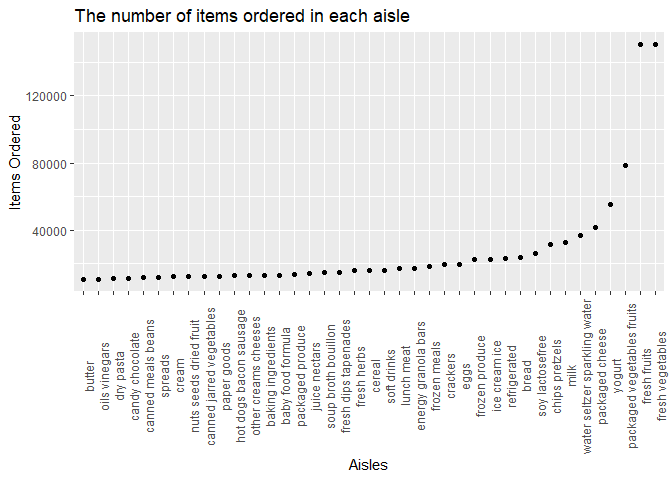
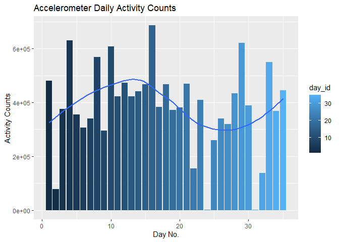
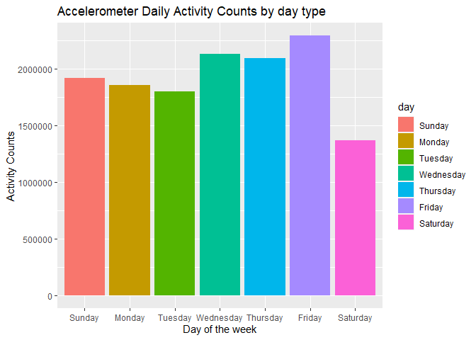
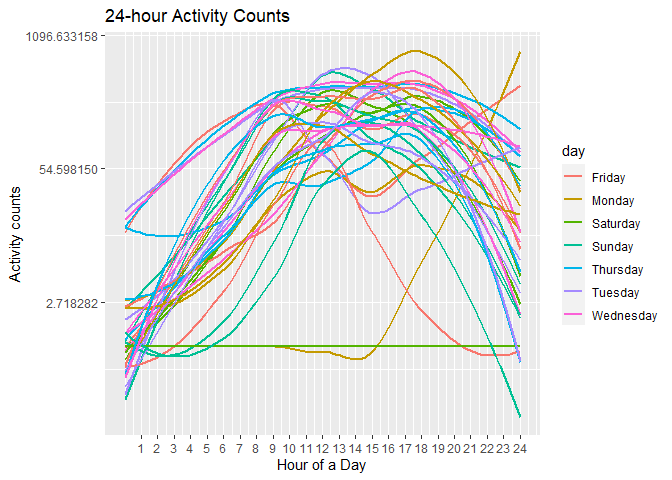

HW3
================

## Problem 1 Solution

#### Importing data

``` r
library(p8105.datasets)
data("instacart")

tail(instacart)
```

    ##         order_id product_id add_to_cart_order reordered user_id eval_set
    ## 1384612  3421063      13565                 2         1  169679    train
    ## 1384613  3421063      14233                 3         1  169679    train
    ## 1384614  3421063      35548                 4         1  169679    train
    ## 1384615  3421070      35951                 1         1  139822    train
    ## 1384616  3421070      16953                 2         1  139822    train
    ## 1384617  3421070       4724                 3         1  139822    train
    ##         order_number order_dow order_hour_of_day days_since_prior_order
    ## 1384612           30         0                10                      4
    ## 1384613           30         0                10                      4
    ## 1384614           30         0                10                      4
    ## 1384615           15         6                10                      8
    ## 1384616           15         6                10                      8
    ## 1384617           15         6                10                      8
    ##                                                             product_name
    ## 1384612 No Salt Added Gluten-Free Blue Chips Made with Organic Blue Corn
    ## 1384613                                           Natural Artesian Water
    ## 1384614                                             Twice Baked Potatoes
    ## 1384615                                  Organic Unsweetened Almond Milk
    ## 1384616                                             Creamy Peanut Butter
    ## 1384617                                               Broccoli Florettes
    ##         aisle_id department_id                         aisle department
    ## 1384612      107            19                chips pretzels     snacks
    ## 1384613      115             7 water seltzer sparkling water  beverages
    ## 1384614       13            20                prepared meals       deli
    ## 1384615       91            16               soy lactosefree dairy eggs
    ## 1384616       88            13                       spreads     pantry
    ## 1384617       32             4              packaged produce    produce

This dataset contains 1384617 rows and 15 variables. The variables
include order_id, product_id, add_to_cart_order, reordered, user_id,
eval_set, order_number, order_dow, order_hour_of_day,
days_since_prior_order, product_name, aisle_id, department_id, aisle,
department. These variables record unique numeric identifiers like ID
about user and product, and descriptive character observations about
name and category.

#### a.

``` r
library(tidyverse)
```

    ## ── Attaching packages ─────────────────────────────────────── tidyverse 1.3.2 ──
    ## ✔ ggplot2 3.3.6      ✔ purrr   0.3.4 
    ## ✔ tibble  3.1.8      ✔ dplyr   1.0.10
    ## ✔ tidyr   1.2.0      ✔ stringr 1.4.1 
    ## ✔ readr   2.1.2      ✔ forcats 0.5.2 
    ## ── Conflicts ────────────────────────────────────────── tidyverse_conflicts() ──
    ## ✖ dplyr::filter() masks stats::filter()
    ## ✖ dplyr::lag()    masks stats::lag()

``` r
instacart %>%
  count(aisle) %>%
  arrange(desc(n))
```

    ## # A tibble: 134 × 2
    ##    aisle                              n
    ##    <chr>                          <int>
    ##  1 fresh vegetables              150609
    ##  2 fresh fruits                  150473
    ##  3 packaged vegetables fruits     78493
    ##  4 yogurt                         55240
    ##  5 packaged cheese                41699
    ##  6 water seltzer sparkling water  36617
    ##  7 milk                           32644
    ##  8 chips pretzels                 31269
    ##  9 soy lactosefree                26240
    ## 10 bread                          23635
    ## # … with 124 more rows

There are 134 aisles. *fresh vegetables*, *fresh fruits* and *packaged
vegetables fruits* are the most items ordered from, all of which have
more than **78000** observations.

#### b.

``` r
library(ggridges)
instacart %>%
  count(aisle) %>%
  filter(n > 10000) %>%
  ggplot(aes(x = aisle, y = n)) + geom_point() + theme(axis.text.x = element_text
  (angle = 90)) +
  labs(
    title = "The number of items ordered in each aisle",
    x = "Aisles",
    y = "Items Ordered"
  )
```

<!-- -->

#### c.

``` r
instacart %>% 
    filter(aisle %in% c("baking ingredients", "dog food care", "packaged vegetables fruits")) %>% 
    group_by(aisle) %>% 
    count(product_name) %>% 
    mutate(rank = min_rank(desc(n))) %>% 
    filter(rank <= 3) %>% 
    arrange(aisle, rank) %>% 
    knitr::kable()
```

| aisle                      | product_name                                  |    n | rank |
|:---------------------------|:----------------------------------------------|-----:|-----:|
| baking ingredients         | Light Brown Sugar                             |  499 |    1 |
| baking ingredients         | Pure Baking Soda                              |  387 |    2 |
| baking ingredients         | Cane Sugar                                    |  336 |    3 |
| dog food care              | Snack Sticks Chicken & Rice Recipe Dog Treats |   30 |    1 |
| dog food care              | Organix Chicken & Brown Rice Recipe           |   28 |    2 |
| dog food care              | Small Dog Biscuits                            |   26 |    3 |
| packaged vegetables fruits | Organic Baby Spinach                          | 9784 |    1 |
| packaged vegetables fruits | Organic Raspberries                           | 5546 |    2 |
| packaged vegetables fruits | Organic Blueberries                           | 4966 |    3 |

#### d.

``` r
instacart %>% 
  filter(product_name == "Pink Lady Apples" | product_name ==  "Coffee Ice Cream") %>%
  group_by(product_name, order_dow) %>% 
  summarize(
   mean_hour = mean(order_hour_of_day)
  ) %>% 
   mutate(
     order_dow = recode(order_dow, "0" = "Sun", "1" = "Mon", "2" = "Tue", "3" = "Wed", "4" = "Thu", "5" = "Fri", "6" = "Sat"),
     mean_hour = round(mean_hour, 2)
     ) %>% 
    pivot_wider(
    names_from = order_dow,
    values_from = mean_hour
  ) %>% 
   knitr::kable()
```

    ## `summarise()` has grouped output by 'product_name'. You can override using the
    ## `.groups` argument.

| product_name     |   Sun |   Mon |   Tue |   Wed |   Thu |   Fri |   Sat |
|:-----------------|------:|------:|------:|------:|------:|------:|------:|
| Coffee Ice Cream | 13.77 | 14.32 | 15.38 | 15.32 | 15.22 | 12.26 | 13.83 |
| Pink Lady Apples | 13.44 | 11.36 | 11.70 | 14.25 | 11.55 | 12.78 | 11.94 |

## Problem 2 Solution

#### a. Load and tidy the data

``` r
accel =
  read_csv("./data/accel_data.csv") %>%
  janitor::clean_names() %>% 
  pivot_longer(
    activity_1:activity_1440,
    names_to = "minute",
    names_prefix = "activity_",
    values_to = "activity_counts") %>% 
  mutate(
    week_section = recode(day,
      "Friday" = "Weekday",
      "Monday" = "Weekday",
      "Tuesday" = "Weekday",
      "Wednesday" = "Weekday",
      "Thursday" = "Weekday",
      "Saturday" = "Weekend",
      "Sunday" = "Weekend"
    )
  )
```

    ## Rows: 35 Columns: 1443
    ## ── Column specification ────────────────────────────────────────────────────────
    ## Delimiter: ","
    ## chr    (1): day
    ## dbl (1442): week, day_id, activity.1, activity.2, activity.3, activity.4, ac...
    ## 
    ## ℹ Use `spec()` to retrieve the full column specification for this data.
    ## ℹ Specify the column types or set `show_col_types = FALSE` to quiet this message.

There are 50400 observations and 6 variables, including information
about week, day (id, name, type), minute and the activity counts.

#### b. Create a total activity variable for each day and a table showing these totals

``` r
accel_day =
accel %>% 
  group_by(day_id, day, week_section) %>% 
  summarize(
    day_counts = sum(activity_counts)
  )
```

    ## `summarise()` has grouped output by 'day_id', 'day'. You can override using the
    ## `.groups` argument.

``` r
knitr::kable(accel_day)
```

| day_id | day       | week_section | day_counts |
|-------:|:----------|:-------------|-----------:|
|      1 | Friday    | Weekday      |  480542.62 |
|      2 | Monday    | Weekday      |   78828.07 |
|      3 | Saturday  | Weekend      |  376254.00 |
|      4 | Sunday    | Weekend      |  631105.00 |
|      5 | Thursday  | Weekday      |  355923.64 |
|      6 | Tuesday   | Weekday      |  307094.24 |
|      7 | Wednesday | Weekday      |  340115.01 |
|      8 | Friday    | Weekday      |  568839.00 |
|      9 | Monday    | Weekday      |  295431.00 |
|     10 | Saturday  | Weekend      |  607175.00 |
|     11 | Sunday    | Weekend      |  422018.00 |
|     12 | Thursday  | Weekday      |  474048.00 |
|     13 | Tuesday   | Weekday      |  423245.00 |
|     14 | Wednesday | Weekday      |  440962.00 |
|     15 | Friday    | Weekday      |  467420.00 |
|     16 | Monday    | Weekday      |  685910.00 |
|     17 | Saturday  | Weekend      |  382928.00 |
|     18 | Sunday    | Weekend      |  467052.00 |
|     19 | Thursday  | Weekday      |  371230.00 |
|     20 | Tuesday   | Weekday      |  381507.00 |
|     21 | Wednesday | Weekday      |  468869.00 |
|     22 | Friday    | Weekday      |  154049.00 |
|     23 | Monday    | Weekday      |  409450.00 |
|     24 | Saturday  | Weekend      |    1440.00 |
|     25 | Sunday    | Weekend      |  260617.00 |
|     26 | Thursday  | Weekday      |  340291.00 |
|     27 | Tuesday   | Weekday      |  319568.00 |
|     28 | Wednesday | Weekday      |  434460.00 |
|     29 | Friday    | Weekday      |  620860.00 |
|     30 | Monday    | Weekday      |  389080.00 |
|     31 | Saturday  | Weekend      |    1440.00 |
|     32 | Sunday    | Weekend      |  138421.00 |
|     33 | Thursday  | Weekday      |  549658.00 |
|     34 | Tuesday   | Weekday      |  367824.00 |
|     35 | Wednesday | Weekday      |  445366.00 |

##### Then create a barplot of activity counts itself and by day type

``` r
accel_day %>%
  group_by(day_id) %>%
  ggplot(aes(x = day_id, y = day_counts, fill = day_id)) + geom_bar(stat = "identity", position = "dodge") + labs(
    title = "Accelerometer Daily Activity Counts",
    x = "Day No.",
    y = "Activity Counts"
  )
```

<!-- -->

``` r
accel_day %>%
  group_by(day) %>%
  ggplot(aes(x = day, y = day_counts, fill = day)) + geom_bar(stat = "identity", position = "dodge") + labs(
    title = "Accelerometer Daily Activity Counts by day type",
    x = "Day of the week",
    y = "Activity Counts"
  )
```

<!-- -->

Trends:

By the one form and two plots above, some apparent trends are as
follows.

-   On the last several days, activity counts tend to be lower than that
    in the beginning days.
-   Tuesday recorded the lowest activity counts, while Monday recorded
    the highest counts.

#### c. Create a single-panel plot that shows the 24-hour activity time courses for each day

``` r
accel %>% 
  group_by(day_id, day, week) %>%
  ggplot(aes(x = as.numeric(minute), y = activity_counts, color = day, group = day_id)) + 
  stat_smooth(se = FALSE, method = "loess") +
  labs(title = "24-hour Activity Counts",
       x = "Hour of a Day",
       y = "Activity counts") +
  scale_x_continuous(
    breaks = seq(60, 1440, 60), 
    labels = as.character(c(1:24))) +
  scale_y_continuous(trans = "log")
```

    ## `geom_smooth()` using formula 'y ~ x'

<!-- -->

Conclusions:

-   9am to 7pm recorded the highest activity counts per day for the 5
    weeks, while other time slots recorded low counts, possibly because
    of sleeping time.
-   Most curves are similar, with pinnacle usually occurred in the
    afternoon.

## Problem 3 Solution

#### a.
